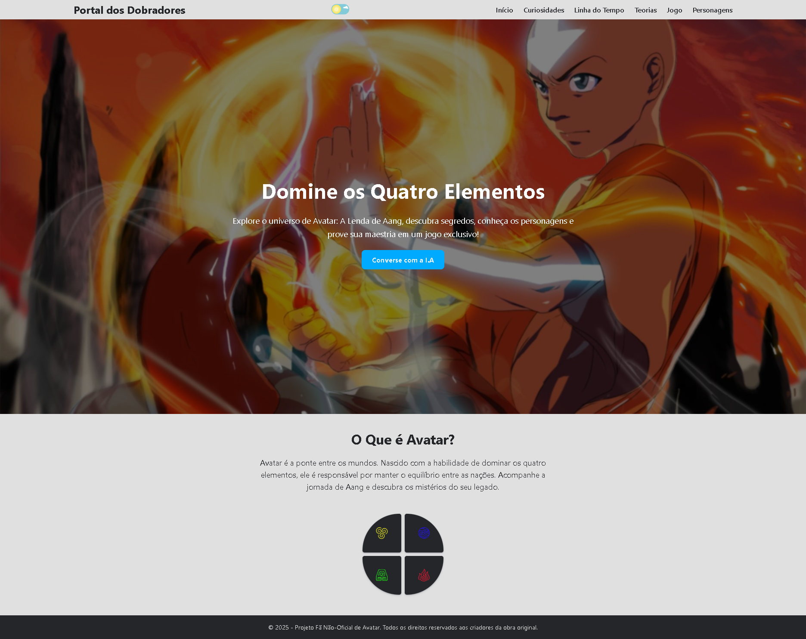

# 🌪️ Portal dos Dobradores

<div align="center">

 [](https://portal-dobradores.vercel.app/)

</div>

Bem-vindo ao **Portal dos Dobradores**!  
Este projeto é um site interativo e responsivo dedicado ao universo de Avatar, reunindo informações, curiosidades, jogos e recursos para fãs.

---

## ✨ Visão Geral

- **Site responsivo** (Mobile First)
- **Barra de navegação** reutilizável e dinâmica
- **Temas claro e escuro** com toggle animado
- **Cards de personagens** com curiosidades e áudios exclusivos
- **Mini-jogo/Quiz** para descobrir sua afinidade elemental
- **Linha do tempo interativa** dos eventos do universo Avatar
- **Glossário**, **teorias**, **fanarts** e muito mais! (em desenvolvimento)

---

## 🖼️ Demonstração

> Confira um exemplo visual abaixo:



## 📁 Estrutura do Projeto

```plaintext
/
├── index.html                 # Página inicial
├── curiosidades.html          # Curiosidades da obra
├── linha-do-tempo.html        # Linha do tempo interativa
├── teorias.html               # Teorias e conspirações
├── quiz.html                  # Quiz: Que tipo de dobrador você seria?
├── personagens.html           # Ficha dos personagens
├── chatIA.html                # Chatbot com personalidade do Tio Iroh
├── navbar.html                # Navbar modular reutilizável
├── css/
│   ├── style.css
│   ├── animations.css
│   ├── chatIA.css
│   ├── curiosidades.css
│   ├── personagens.css
│   ├── quiz.css
│   ├── responsive.css
│   ├── tema.css
│   ├── teorias.css
│   └── timeline.css
├── js/
│   ├── modais.js
│   ├── navbar-dropdown.js
│   ├── personagens.js
│   ├── quiz.js
│   ├── tema.js
│   └── teorias.js
└── assets/
    ├── icones/
    ├── imagens/
    ├── sons/
    └── sprites/
```

---

## 🚀 Funcionalidades

- **Navegação modular**: Navbar carregada dinamicamente em todas as páginas.
- **Tema escuro/claro**: Alternância suave entre temas inspirados no universo Avatar.
- **Cards de personagens**: Com curiosidades, frases e reprodução de áudios únicos.
- **Quiz interativo**: Descubra sua nação elemental.
- **Linha do tempo**: Eventos marcantes do universo Avatar.
- **Curiosidades e teorias**: Conteúdo organizado e visualmente atrativo.
- **Fanart e Fanfic**: Espaço para a comunidade compartilhar suas criações (em desenvolvimento).
- **Chatbot**: Converse com o Tio Iroh.
- **Totalmente responsivo**: Experiência otimizada para smartphones, tablets e desktops.

---

## 📱 Responsividade

- Menu hamburguer para navegação mobile
- Layouts adaptados para diferentes tamanhos de tela
- Imagens e cards fluidos

---

## 🌈 Temas

- **Modo Claro**: Inspirado no Templo do Ar
- **Modo Escuro**: Inspirado na Nação do Fogo
- Toggle animado para alternância

---

## 🛠️ Como rodar o projeto

Você pode acessar o portal por [aqui](https://wilsondesouza.github.io/portal-dobradores/) OU [aqui](https://portal-dobradores.vercel.app/)

OU

1. Clone o repositório:
   ```bash
   git clone https://github.com/wilsondesouza/portal-dobradores.git
   ```
2. Abra o arquivo `index.html` no navegador.
3. Navegue pelas páginas e explore!

> **Dica:** Para melhor experiência, utilize uma extensão de servidor local como [Live Server](https://marketplace.visualstudio.com/items?itemName=ritwickdey.LiveServer) no VS Code.

---

## 🤝 Contribuindo

Contribuições são bem-vindas!  
Siga os passos abaixo para colaborar:

**Contribuição Técnica**
1. Faça um fork do projeto
2. Crie uma branch para sua feature/correção:
   ```bash
   git checkout -b minha-feature
   ```
3. Commit suas alterações:
   ```bash
   git commit -m "Descrição clara da alteração"
   ```
4. Push para seu fork:
   ```bash
   git push origin minha-feature
   ```
5. Abra um Pull Request

> Para sugestões, ideias ou dúvidas, utilize as [Issues](https://github.com/wilsondesouza/portal-dobradores/issues) ou entre em contato pelas redes sociais.

---

## 💡 Ideias Futuras

- Submissão e curadoria de fanarts/fanfics
- Sistema de comentários e votos
- Novos mini-jogos e desafios
- Mais customização no chatbot

---

## 📄 Licença

Este projeto é um fã-site não-oficial, sem fins lucrativos, e respeita os direitos dos criadores originais de Avatar.

---

<div align="center">
    <strong>Feito com paixão por <a href="https://github.com/wilsondesouza">@wilsondesouza</a> 💧⛰️🔥🌪️</strong>
</div>